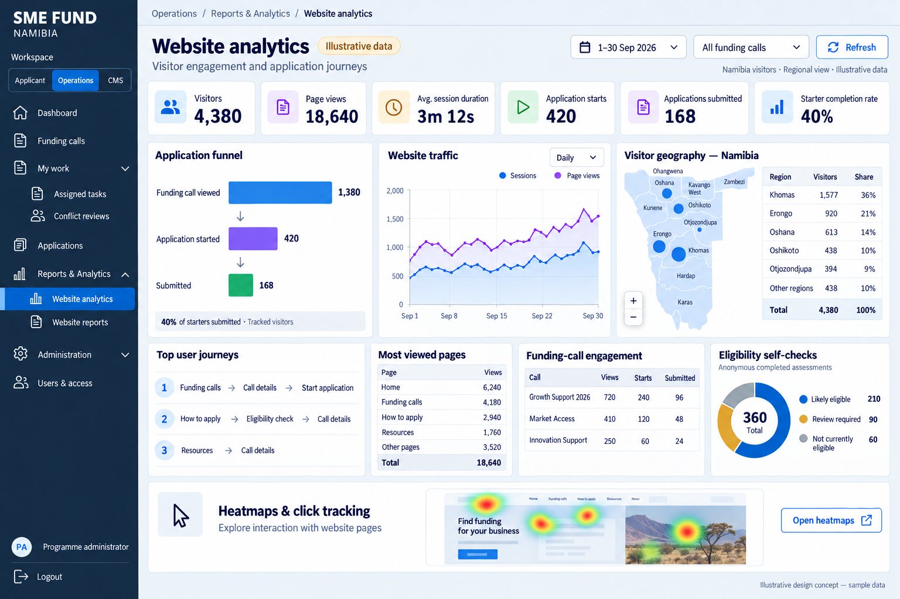

# SME Fund Reporting and Analytics Implementation Plan

Date: 2026-10-06. Status: planned implementation; phases require separate acceptance.

Deliver D1 first, then R1 and R2 in small increments. Use the latest generated
D1 image for layout, the application's canonical tokens for styling, and the
existing reporting, authorization and notification boundaries for implementation.
This plan defines the future sidebar arrangement; application code is not changed
by creating this document.

## Scope and client sources

| Item | Client requirement | Implementation depth here |
| --- | --- | --- |
| D1 | Administrator website analytics dashboard | Detailed; first delivery |
| R1 | Bi-weekly website analytics email | Detailed; after D1 |
| R2 | Monthly website analytics email | Detailed; reuse R1 machinery |
| D2 | Staff workflow and programme reporting: pipeline, ageing, turnaround, outcomes, reviewer load, commitments and indicators | Later scope only |
| D3 | Public CMS-managed programme statistics, maps, charts and exports | Later scope only |
| R3 | Monthly chatbot interaction analytics | Later scope only; no separate chatbot dashboard requested |
| R4 | Application data export to Excel or CSV | Later scope only |

Sources: [Terms of Reference](client/Terms%20of%20Reference%20-2.pdf), pages 7–9
and 12–13; [Workflow Specification](client/ME-Workflow-Engine-Specification.docx),
section 10; [Inception Report](client/Pro%20SME%20Project%20Inception%20Report.pdf),
pages 9 and 15. Anonymous eligibility analytics and heatmap/click-tracking
integration belong to D1. Do not add report builders, chatbot panels, forecasts,
ERP integration or new D2/D3/R3/R4 routes during these phases.

## D1 visual and brand contract



Use this latest, denser reference: six metric cards; funnel, traffic and Namibia
geography row; journeys, pages and call engagement row; eligibility and platform
heatmap/scroll-depth panels side by side. Dates, counts, labels and heatmap thumbnail are illustrative, not production
data. The new section headings below supersede the image's expandable analytics
parent. Preserve its contrast and density, with responsive stacking on small screens.

Canonical palette: `apps/platform/src/shared/ui/brand-tokens.css` and
`brand-theme.css`. Use CSS variables and existing variants, not copied image hexes.

| Token | Current value | D1 use |
| --- | --- | --- |
| `brand-navy` | `#0a183b` | Sidebar, headings, readable text and chart outlines |
| `brand-blue` | `#6baed6` | Main traffic series, map selection and chart accents |
| `brand-gold` | `#c9a24d` | Second series and secondary chart categories |
| `brand-orange` | `#ff6f00` | Existing action/icon accents and selected emphasis |
| `brand-yellow` | `#ffca45` | Supporting category/highlight where contrast permits |
| `brand-green` / `brand-green-soft` | `#16a34a` / `#a8dfbc` | Eligible/completed semantic states |
| `brand-white` / `brand-cream` | `#ffffff` / `#f6f4e2` | Cards and page surfaces |

The subsequently approved KPI reference uses compact white cards, muted labels
above values, upper-right blue/violet icon tiles and real previous-period changes.
For those tiles use the existing Tailwind blue/violet palette; this supersedes the
earlier instruction to replace those accents. Keep canonical tokens for the rest
of the dashboard. Reuse
`GeneralButton`, shared tables, form controls, skeletons, badges, page shell and
navigation. Evaluate `DashboardMetricCard` for a compact variant; move a touched
domain-neutral primitive into `shared/ui` when required, without copying it.
Charts need labelled values/legends and accessible text or table equivalents.

## Sidebar section headings

Add labelled, non-clickable groups to the shared navigation renderer. Keep route
ownership, permission filtering, active states, pending navigation and nested
controls. Group metadata must not masquerade as a route or gain a fake `href`.

```text
Workspace: Applicant | Operations | CMS
Dashboard

ANALYTICS
  Website analytics                         /admin/analytics/website

APPLICATION MANAGEMENT
  Applications
  Funding calls
  My work
    Assigned tasks
    Conflict reviews

REPORTING
  Website reports                           /admin/reports/website

ADMINISTRATION
  Administration                            existing children retained
  Users & access

Profile and Logout
```

Derive visible sections after filtering routes; omit empty groups. Hide visual
heading text in collapsed mode while preserving accessible group labels. Keep
the existing workspace switcher and mobile navigation behavior. Content management
remains in CMS; do not duplicate its menu in Operations. Add Website reports when
its phase ships, with bi-weekly/monthly views inside one page. Do not add links to
unimplemented features. Evaluate a shared `NavigationSection` type/component and
keep route declarations separate from rendering if either file becomes unwieldy.

## Ownership and data flow

Follow [AGENTS.md](../AGENTS.md) and the
[structure contract](SME_Fund_Project_Structure_Contract_FINAL.md). One deployable
application remains at `apps/platform`; no separate analytics application.

```text
Consent-controlled website events → Google Analytics 4
D1 → useWebsiteAnalytics → ClientReportingService → /api/reporting/website
   → ServerReportingService → reporting SQL projection → stored GA aggregates + eligibility totals
Existing scheduler → /api/internal/reporting/process → analytics synchronization service
   → GoogleAnalyticsAdapter → dedicated reporting tables in existing PostgreSQL
Later R1/R2 scheduled generation → immutable email report + notification occurrence
   → existing email dispatch
```

Use `src/modules/reporting` with flattened client/server services; `domain` owns
metrics/period rules, `api` owns Zod transport contracts, `infrastructure` owns
provider adapters/schema/repositories, `application` owns scheduled use cases and
`ui` owns views/hooks. Firebase remains authentication; this is a separate Google
Analytics integration. Move the existing analytics consent implementation from
its legacy integration path into reporting UI when touched. Configure the browser
measurement ID through environment variables; keep the CMS settings page and hide
its legacy measurement ID field. Keep provider credentials server-only and outside Payload.

Core totals use GA Data API; ordered funnels use the funnel API behind the same
adapter. Validate actual API capabilities before binding panels. Bound rows,
date ranges and external concurrency. D1 persists completed aggregates in dedicated
tables in the existing PostgreSQL database, rather than depending on a live GA
request or process-local cache when the dashboard is opened. Raw visitor events
remain in GA. Store each exact property, timezone, date range and funding-call scope;
do not sum daily distinct-user counts or reconstruct ordered funnels from daily totals.

`app_reporting_website_queries` records requested report scopes, refresh deadlines
and bounded worker leases. `app_reporting_website_source_snapshots` retains the last
successful result for each source independently. Background synchronization updates
successful sources and records failures without overwriting previous aggregates.
The dashboard uses one consolidated SQL projection for stored sources, SQL eligibility
totals and previous-period changes. Authorization precedes all repository access.
Show pending, stale and unavailable states honestly, with source refresh timestamps.
Only compare an equal-length previous period when collection covered that period;
missing reports and zero comparison denominators do not become fabricated percentages.

### D1 files and panel responsibilities

All listed UI files live under `reporting/ui/website`. Each chart is its own
component in its own file. Chart components receive typed data; they do not fetch,
authorize, parse responses or calculate business metrics inside JSX.

| File | Responsibility |
| --- | --- |
| `WebsiteAnalyticsWorkspace.tsx` | Compose filters, query state and panel grid |
| `WebsiteAnalyticsFilters.tsx` | Date range, funding call and shared Refresh control |
| `WebsiteAnalyticsMetrics.tsx` | Compose six instances of the reused metric card |
| `WebsiteTrafficChart.tsx` | Daily page-view/session series, axes, legend and tooltip |
| `WebsiteApplicationFunnelChart.tsx` | Four ordered call-view/check/start/submission stages with native labels |
| `WebsiteVisitorGeography.tsx` | Compose regional map with region count selection; no geography table |
| `NamibiaVisitorMap.tsx` | Interactive Namibia regional map with hover/focus detail |
| `WebsiteVisitorRegionsTable.tsx` | Regional visitors, share and unknown coverage |
| `WebsiteUserJourneys.tsx` | Top observed public-page sequences ranked by tracked users |
| `WebsiteMostViewedPages.tsx` | Ranked, bounded page-view table |
| `WebsiteFundingCallEngagement.tsx` | Call views and consistently labelled start/submission measures |
| `WebsiteEligibilityChart.tsx` | Anonymous self-check outcome donut and legend |
| `WebsiteHeatmapPanel.tsx` | Platform-owned click hotspots over masked layout geometry and scroll-depth shares; filter by captured layout and dashboard date/call scope |
| `useWebsiteAnalytics.ts` | TanStack query keys, cancellation, caching and refresh |

Use Apache ECharts through the shared SVG chart component for every chart,
including the dashboard status ring. Use its native four-stage funnel, traffic
lines and eligibility ring. Visitor geography follows the `geo-choropleth-scatter`
example with one Namibia geo projection shared by the map and scatter series.
Shade regions by their recorded user count; place scatter markers at derived
region centres only for positive recorded counts. These markers represent region
totals, not individual visitor coordinates. Retain the sourced fourteen-region
GeoJSON and attribution. The funnel and traffic plotting areas are 360px high
in a shared two-column row. Geography occupies its own full-width row with a
560px plotting area; fit the country while preserving its geographic proportions.
The geography table is omitted. Use the canonical app navy, blue, gold, orange,
green and cream palette. Funnel labels/counts, legends, tooltips and traffic
zoom/export controls belong to ECharts. Keep chart explanations and source details
in the shared information tooltip rather than visible caption paragraphs.
Search for compatible wrappers before creating
chart framing or theme helpers. Store an accurately sourced, reusable Namibia
boundary asset separately; record its source/licence and verify regional keys.
The generated map is a layout illustration, not authoritative boundary geometry.

Target components/services below 200 lines, pages/routes below 100, functions
below 80 and tests below 250. Split before reaching those working targets. Respect
AGENTS hard limits and the stricter current file gate (400 implementation/300 test
lines); never compress code to pass. Split provider queries by responsibility and
scheduled generation from schedule administration. No all-charts file.

### D1 metrics and collection

Six cards: visitors, page views, average session duration, application starts,
applications submitted and starter completion rate. Define visitors as GA
`totalUsers`; use `screenPageViews` and `averageSessionDuration` for traffic.
Define start/submission cards as tracked users reaching those steps and label
them accordingly; they are not PostgreSQL application totals. Completion uses
ordered funnel users submitted / users started; no denominator means unavailable.

Track `funding_call_view`, `call_document_download`, `eligibility_check_complete`,
`application_start` and `application_submit`. Register funding-call/page-category
dimensions. Fire successful start/submission signals after server confirmation,
deduplicate retries/rerenders and keep tracking continuous across public/auth/portal
navigation. The subsequently approved application funnel has four ordered stages:
Funding Call View, Eligibility Check Completed, Application Started and Application
Submitted. Query that exact sequence; use contract `d1-v2` so older three-stage
stored results cannot be displayed as four-stage results. Every call-filtered
funnel step uses the same call scope; validate cross-call sessions explicitly.

Use consent-aware browser tracking through `ClientWebsiteAnalyticsService.ts`;
components/hooks must not call Google SDKs directly. Send only approved event
metadata; sanitize page URLs/referrers and omit applicant identifiers, answers,
free text, documents and reviewer information. Heatmaps capture approved public
pages with masking, not applicant/staff/CMS forms. Heatmap capture, storage and
rendering are platform-owned; Microsoft Clarity is removed. Capture only numeric
geometry, click cells and maximum scroll depth after explicit consent. Never
capture DOM text, images, form values, attributes or visitor identities. Separate
viewport sizes and captured layout versions. Bound traversal, payloads and event
counts, use passive throttled listeners and idle batched uploads, and aggregate
in SQL. `WEBSITE_HEATMAP_ENABLED=true` enables collection after migration 0167;
saved data remains viewable when collection is disabled. GA does not supply heatmaps.

Geography displays Namibia and its 14 regions, filtering GA country to Namibia.
Verify IP-derived region names against live results; do not use business-profile
regions to describe website visitors. Preserve unknown/unmapped/thresholded data.
Other panels remain website-wide unless explicitly filtered; label that difference.
Distinct users can appear in multiple calls or regions: do not force grouped counts
to sum to site-wide users. Agree and label the regional-share denominator.

Journeys show the top three observed sequences of two or three public-page steps, ranked by tracked users, with readable labels and arrows. Authentication and portal activity are excluded; the public Start application handoff is an endpoint. Empty, failed and stale sources remain explicit.
Prove the available API query for each; arbitrary GA path exploration is not assumed.
Log anonymous self-check outcomes, call/ruleset version and timestamp in PostgreSQL;
retain only approved non-identifying assessment categories, never raw free text or
account/session/IP identifiers. Aggregate in SQL. Keep advisory results separate
from formal eligibility decisions. Test that logging failure cannot block guidance.

Every panel distinguishes loading, no data, unavailable, failure and stale data.
Expose collection start, source coverage and relevant GA thresholding/sampling.
Keep successful panels usable when another source fails. No demo data in production.

## R1 and R2 persistence and delivery

Implement one fixed website report model and two period schedules. R1's exact
meaning of bi-weekly (proposed every 14 days, anchored to an agreed date) requires
agreement; R2 covers the previous calendar month. Align report boundaries with
the GA property timezone and the agreed local send time; convert database times
to UTC. Allow a defined source-finalization delay before generation.

Module-owned repeatable migrations add `app_reporting_schedules`,
`app_reporting_runs`; anonymous eligibility and D1 source aggregates already exist.
Schedules hold frequency,
timezone, period anchor, next due time, enablement and a notification-event reference.
Reuse existing notification event rules as the authoritative designated-recipient
configuration; expose or link that configuration from Website reports. Avoid a
second independently editable recipient list. Only active users with report access
may receive these reports; revalidate before delivery/retry.

Runs retain schedule/version, period bounds, metric-contract version, scope,
generated time, immutable normalized data/source metadata, generation state and
linked occurrence ID. Unique schedule/period identity prevents duplicate generation.
Email delivery status remains in existing notification tables, not copied status
flags. Raw GA visitor events stay in GA; only completed aggregates are persisted.

Claim bounded due work with leases and recovery, request source synchronization
and wait for completed aggregates for the exact period, then atomically finalize
the immutable email snapshot, capture occurrence
and advance schedule. Repeated/crashed/concurrent invocations resume safely.
Generation failures retry without becoming zeros or advancing past an unsent
required report. Define a bounded missed-period catch-up policy.

Add typed reporting events, published templates and seed/migration support in
notifications. Render a branded HTML/plain-text summary of the same D1 metrics,
top pages/calls, Namibia regions, journeys and eligibility, with period/source
notes and a link to the authorized saved report. Preserve template escaping; the
existing renderer does not accept arbitrary HTML through text placeholders.
Use fixed bounded text/table fields or a narrowly scoped safe report renderer.
Attachments and customizable report templates are outside this first delivery.

Website reports uses shared tables for history, snapshot detail and schedule
configuration. Forms use React Hook Form, Zod and `zodResolver`. Snapshot viewing
must remain possible during a GA outage. SMTP delivery is at-least-once: database
idempotency prevents duplicate occurrences, but a send-success/receipt crash can
still cause retry; do not promise exactly-once delivery without provider support.

## Permissions and routes

Proposed canonical codes: `reporting.website.read.all`,
`reporting.website-report.read.all` and `reporting.website-schedule.update.all`.
Add explicit catalogue descriptions/groups and allowed/denied tests. Validate
target schedule, report kind and recipient eligibility; permission to read
applications or manage CMS is not reporting authorization. Platform heatmap
reads use `reporting.website.read.all`. Public writes require exact analytics
consent, same-origin request context and a strict bounded approved-page schema.

Keep pages under `(operations)` and APIs under `app/api`: website read, bounded
report list/detail and schedule update. Use the existing service-processor
authorization for `/api/internal/reporting/process`; human schedule permissions
do not replace processor credentials. Services enforce rules; routes never query
tables. Reuse audit infrastructure for schedule/recipient changes.

## Ordered implementation and acceptance

| Phase | Focused tasks and reviewable result | Required evidence |
| --- | --- | --- |
| 1 D1 contracts and visual shell | Fix metrics/scopes and brand mapping; add sidebar sections; compose the reference panels in separate files with typed development fixtures | Permission-filtered/empty/collapsed/mobile navigation tests; brand contrast, responsive and keyboard review. Fixture UI is preview acceptance only |
| 2 D1 tracking and source proof | Extend consent/service tracking; enable authorized GA property/API access; prove totals, ordered same-call funnel, Namibia regions and observed public journeys | Live test journey; consent/retry/URL sanitization tests; source samples confirm coverage. Agree region and journey limitations before accepting those panels |
| 3 D1 complete | Persist completed GA aggregates in existing PostgreSQL; bind independent panel results through one SQL projection; add anonymous self-check aggregation; implement platform-owned masked public-page click/scroll heatmaps; correct compact KPI cards and keep empty charts visible | Adapter/error/partial-data and authorization tests; SQL projection, heatmap retry/depth/layout/period scope, refresh lease, outage and restart persistence tests; browser check against reference and real API results. D1 accepted before R1 work |
| 4 R1 | Add migrations, schedules/runs, report page, typed notification event/template and protected processor; enable only the agreed bi-weekly schedule | Period-boundary, recipient denial, concurrent generation, crash recovery and SQL pagination tests; actual email and saved snapshot reconcile |
| 5 R2 | Enable calendar-month scheduling through the same generation/rendering/delivery code | Short months, year changes, timezone boundaries and simultaneous schedules; monthly email and history verified |

For each implementation phase run architecture/form boundary and file-size gates,
lint, typecheck, focused and full tests, and production build. Run build and
standalone typecheck sequentially to avoid generated-type races. Verify repeatable
migrations on an isolated database. Record browser, live API, email and deployment
evidence separately from mocks/static checks in a concise phase gate document.
Baseline failures remain named failures; written acceptance must identify scope
and unresolved dependencies. A phase cannot claim live acceptance from fixtures.

Inputs can be settled during independent UI work: GA property access and timezone,
custom dimensions, real region/journey coverage, licensed regional geometry,
heatmap migration/capture activation and browser verification, designated recipients, bi-weekly meaning/anchor, send
time and source-finalization delay. Do not enable dependent live reporting until
its required configuration and period policy are agreed.

Technical references: [GA dimensions and metrics](https://developers.google.com/analytics/devguides/reporting/data/v1/api-schema),
[funnel reporting](https://developers.google.com/analytics/devguides/reporting/data/v1/funnels),
[quotas](https://developers.google.com/analytics/devguides/reporting/data/v1/quotas)
and [source response metadata](https://developers.google.com/analytics/devguides/reporting/data/v1/rest/v1beta/ResponseMetaData).
